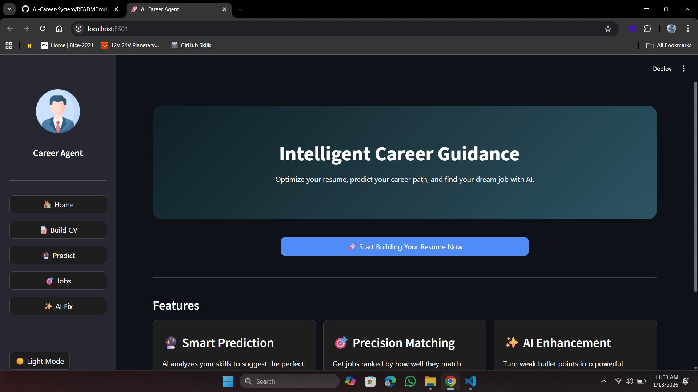
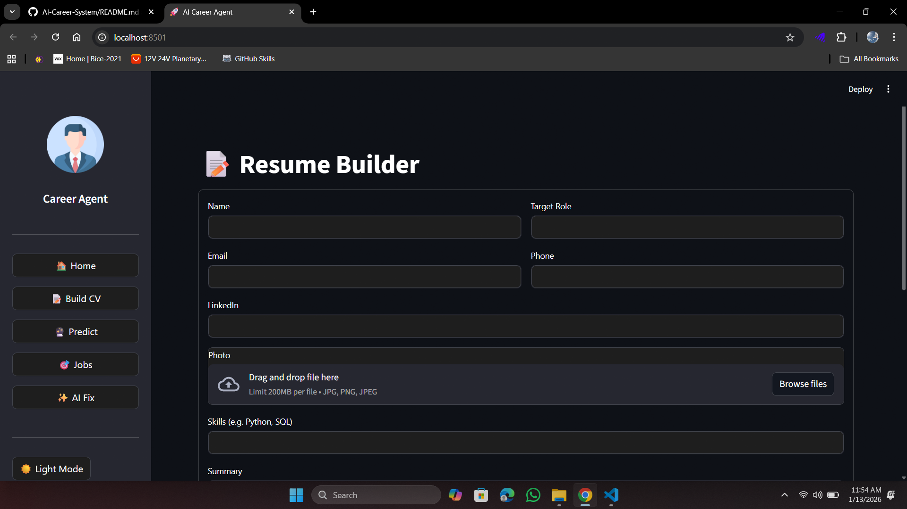
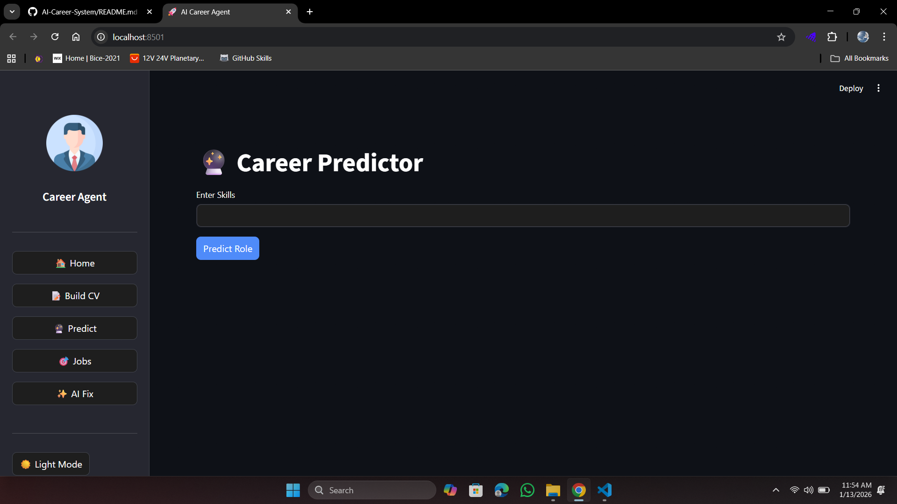
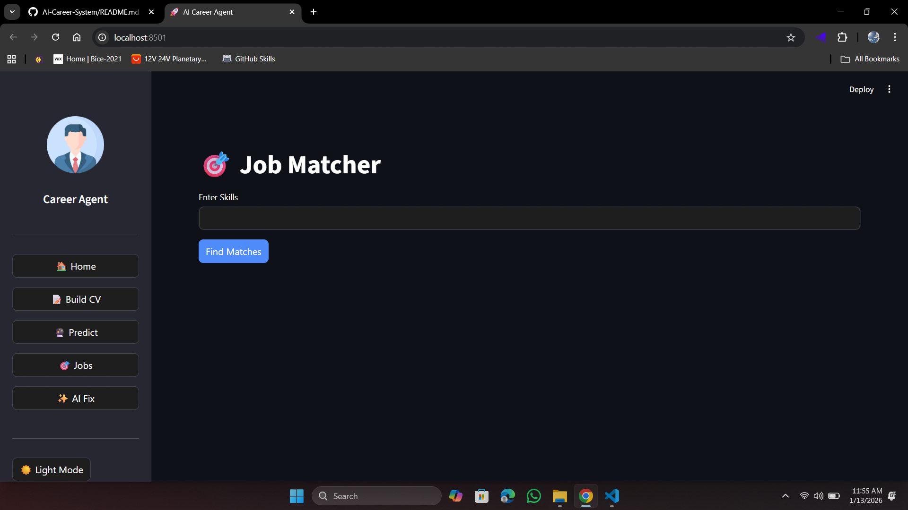

# 🚀 Intelligent Career Guidance System


An AI-powered application that helps students and professionals optimize their resumes, predict suitable career paths, and find relevant job opportunities using Machine Learning and Generative AI.

## 🌟 Features

1.  **Smart Resume Parsing:** Extracts skills and text from PDF resumes.
2.  **Career Prediction:** Uses keyword analysis to predict the best job role for you.
3.  **Job Matching:** Calculates a mathematical "Similarity Score" (Cosine Similarity) between your resume and a database of jobs.
4.  **AI Resume Enhancer:** Uses Google Gemini (GenAI) to rewrite weak bullet points into professional success stories.
5.  **PDF Generation:** Automatically builds a formatted, downloadable PDF resume.

## 🛠️ Tech Stack

* **Frontend:** Streamlit
* **Backend:** Python
* **AI/LLM:** Google Gemini API
* **Data Processing:** Pandas, Scikit-Learn (TF-IDF, Cosine Similarity)
* **PDF Handling:** PyMuPDF, FPDF

## ⚙️ Installation & Setup

1.  **Clone the Repository**
    ```bash
    git clone [https://github.com/YOUR_USERNAME/AI-Career-System.git](https://github.com/YOUR_USERNAME/AI-Career-System.git)
    cd AI-Career-System
    ```

2.  **Create Virtual Environment**
    ```bash
    python -m venv venv
    # Windows
    .\venv\Scripts\Activate
    # Mac/Linux
    source venv/bin/activate
    ```

3.  **Install Dependencies**
    ```bash
    pip install -r requirements.txt
    ```

4.  **Set Up API Keys**
    * Create a `.env` file in the root directory.
    * Add your Google Gemini API key:
      ```
      GOOGLE_API_KEY=your_api_key_here
      ```

5.  **Run the App**
    ```bash
    streamlit run app.py
    ```

## 📸 Screenshots

### 🏠 Home Dashboard



### 📝 Resume Builder


### 🔮 Career Prediction


### 🎯 Job Matching Results


### ✨ AI Resume Fixer


## 🤝 Contribution
Feel free to fork this repository and submit pull requests.